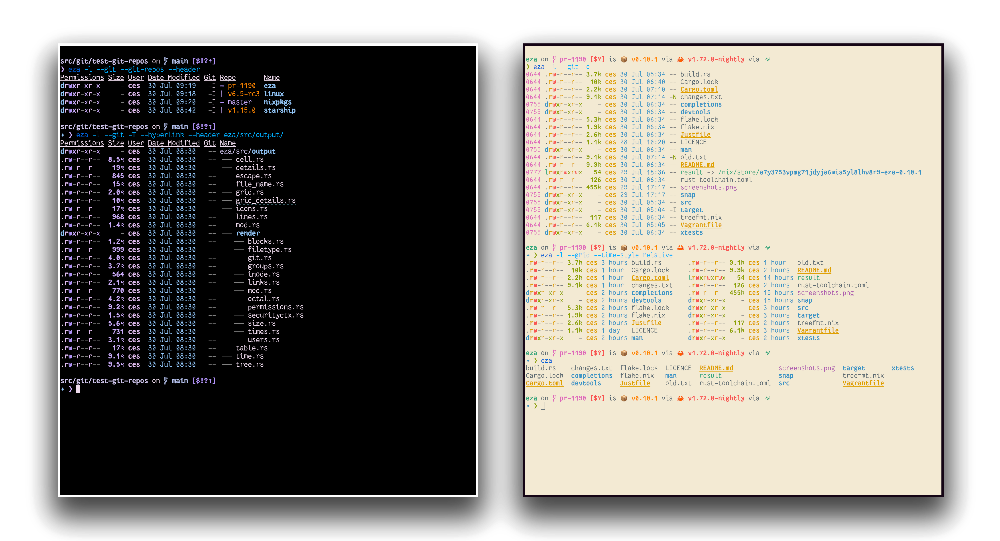

### Contact

- linkedin.com/in/fcosanabria
- github.com/fcosanabria
- instagram.com/digital.death.disrupt


<!-- end_slide -->

## CC0


`github.com/fcosanabria`

<!-- speaker_note: |
Copy, right? Esta presentación se encuentra publicada complememente al dominio publico. Todo lo que veran aqui como links,
imagenes y script se encuentra en mi repositorio de GitHub

Esta presentación se encuentra inspirada por NoBoilerplate.
-->
<!-- end_slide -->

# Disclaimers

- Spanglish
- Tyop
- Gazapos gramaticales
- Strong Opinions + jokes
- Tool installation ✅ - se permite


# Concepts

- macos = darwin = bsd = unix = posix compatible
- opt = alt
- cmd = super

<!-- speaker_note: |

- la tecla Altgr+compose key en linux es un poco complicada de usar.

- Ademas tambien se perfectamente que todo esto que van a ver aqui les va a parecer complememente inutil. Y cada que les
ensene una nueva herramienta o workflow van a pensar, y para que esto? De que me sirve?
- por que pueden serguir usando sus herramientas del dia a dia, sin ningun problema, por que son unas 10x developers.

- Y probablemente me llamen la atencion despues de esta presentacion, por dirigirme a Ustedes de manera tan despiadada y mezquina.
- Pero bueno, dejando las bromas, (no tan bromas y verdades) de lado. Espero que no se tomen las tomen a pecho. Genuinamente los quiero
un monton.

- Y si, todo lo que veran aqui, lo uso todos los dias de mi vida, en todas mis computadoras. Esto no me hace ser mejor ingeniero,
pero si me permite tener mas tiempo ~ para procrastinar aun mas.

-->

## Slides

- font: berkeley mono: https://usgraphics.com/products/berkeley-mono
  - not free
- presenterm
  - plain text slides using markdown

<!-- end_slide -->

# Keyboard Navigation

<!-- incremental_lists: true-->

<!-- speaker_note: |
- Antes de comenzar con la terminal, primero me gustaria hablar de lo mas importante: el uso del teclado para maxima efectividad
- Ustedes no saben la congoja que me da ver a la gente usan el mouse, las fechas y todo eso para navegar por el sistema operativo.
  - Claro yo entiendo el hecho de que es complememente. Ustedes se me volveran super enojados diciendo, diay? Como hago las varas,
entonces?
- Bueno, les comento las posibilidades:
-->

- CAPS LOCK 🤮
- Arrows
- Enter
- Press and Hold PopUp

<!-- end_slide -->

### Karabiner Elements

<!-- incremental_lists: true-->

- Keyboard Remapping Software

#### Examples

  <!-- speaker_note: |
    pregunta, levante la mano el que usa alt en macOS mas de 2 veces al dia que no sea para shortcups o keybindings
    -->

- Caps Lock -> Esc + Ctrl/Cmd
  - Esc + Hyper/Meh
- Remap Alt as Layer
  - I J K L (wasd motions)
  - H J K L (vim motions)
  - alt + m -> Enter (ctrl + m = ^M in Unix = "Enter" (in terminal emulations))
    - Return en Unix
  - Move around Workspaces


<!-- speaker_note: scan code generation y el virtual key code translation son los mismos que el de enter -->

<!-- end_slide -->

### Homerow

DO NOT USE YOUR MOUSE!!!!!!!!

Homerow is software that allows you to label every element in your screen with a series of simbols to select and click.

`https://www.homerow.app/`

### Press and Hold

- Acentos -> hold 300ms = The worst PopUp menu ever created in human history
<!-- incremental_lists: true-->
- Alt permite realizar acentos de manera mas sencilla. (Si saben usar touchtyping lol)

#### Disable press and hold

```
defaults write -g ApplePressAndHoldEnabled -bool false

# logout or restart
```

#### Usage

```
opt + e + a
opt + e + e
opt + n + n
```

<!-- end_slide -->

# Window Manager

- Avoid using the mouse to switch windows and resizing you apps
<!-- incremental_lists: true-->
- cmd + tab = ✅ 50/50
- macos window snapping = ❌
  - stage manager

## Solution

- Tiling window manager
  - Aerospace
  - Yabai + skhd
  - Amethyst
- Snapping window manager
  - Magnet
  - Rectangle
  - Rectangle Pro

<!-- incremental_lists: false-->

<!-- column_layout: [1, 1] -->
<!-- column: 0 -->

> Combinarlas con Hyper/Meh

```
hyper + y u i o
hyper + c
hyper + m
```

<!-- column: 1 -->


<!-- end_slide -->

# Tools

## Managing Containers

<!-- end_slide -->

# Oxker

Manage your Containers without using Docker Desktop

`https://github.com/mrjackwills/oxker`


<!-- end_slide -->

# Lazydocker

Lazygit like TUI for containers!!

`https://github.com/jesseduffield/lazydocker`


<!-- end_slide -->

# ctop

Top-like interface for container metrics

`https://github.com/bcicen/ctop`


<!-- end_slide -->

# Docker Clients

Stop using Docker Desktop!

## Orbstack

`https://orbstack.dev/`

Lightweight and ultrafast


<!-- end_slide -->

# Docker Clients

## Podman

`https://podman.io`

<!-- end_slide -->

# Docker Clients

macOS uses the Darwin kernel, which doesn’t support Docker’s native containerization features
(such as namespaces and cgroups) available on Linux.

## Docker Engine + Colima

<!-- speaker_note: To work around this, you need a Linux virtual machine (VM) running in the background.
 -->

Colima is a Lightweight VM environment for macos

`https://github.com/abiosoft/colima`

> Resources and tips: https://dev.to/mochafreddo/running-docker-on-macos-without-docker-desktop-64o

<!-- end_slide -->

# Tools

## File manager

### Yazi

Blazing fast terminal file manager written in Rust,

`https://github.com/sxyazi/yazi`


<!-- end_slide -->

# Tools

## Terminal Quality of Life Tools

# eza

`https://github.com/eza-community/eza`

- ls replacement



<!-- end_slide -->

# zoxide

`https://github.com/ajeetdsouza/zoxide`

- cd replacement
- Remembers past locations

```
z foo              # cd into highest ranked directory matching foo
z foo bar          # cd into highest ranked directory matching foo and bar
z foo /            # cd into a subdirectory starting with foo

z ~/foo            # z also works like a regular cd command
z foo/             # cd into relative path
z ..               # cd one level up
z -                # cd into previous directory

zi foo             # cd with interactive selection (using fzf)

z foo<SPACE><TAB>  # show interactive completions (zoxide v0.8.0+, bash 4.4+/fish/zsh only)
```

<!-- end_slide -->

- bat `https://github.com/sharkdp/bat`
  - cat replacement


<!-- end_slide -->

- fish - `https://fishshell.com/`
  - A shell for the era - smart and user friendly
  - You can still making your unsafe bash scripts ;)
  - `brew install fish`

<!-- end_slide -->

# Tools

## Terminal Quality of Life Tools

### Glow

markdown interactive viewer in the terminal


<!-- end_slide -->

# Starship

The minimal, blazing-fast, and infinitely customizable prompt for any shell!

<!-- speaker_note: |
El motivo de una herramienta como Starship es para las personas que normalmente trabajan en la terminal de manera
más habitual. Hace que se vea comoda, y proporciona infomación súper valiosa. Por ejemplo, si estamos logeados a
azure o gcp, o cual python virtual environment estamos usando, así como la versión de Ruby, o Nodejs que estamos usando.
Cosas de ese tipo hacen que uno sea más proctivo, o al menos que se disfute más
-->


<!-- end_slide -->

# Dotfiles

Los archivos de configuración que hacen la experiencia más personal

<!-- incremental_lists: true-->

- Comienzan con punto (.) ~ Dotfiles dah!
- Configuraciones personales de las herramientas que usamos
  - Shell, editor, herramientas CLI

<!-- speaker_note: |
Los dotfiles son básicamente todos esos archivos de configuración que personalizan tu experiencia
en la terminal y herramientas. Se llaman dotfiles porque en Unix los archivos que empiezan con punto
están ocultos por defecto.
-->

<!-- end_slide -->

## Qué son los Dotfiles?

```bash
# Ejemplos comunes
~/.zshrc          # Configuración de Zsh
~/.gitconfig      # Configuración de Git
~/.vimrc          # Configuración de Vim
~/.tmux.conf      # Configuración de Tmux
~/.ssh/config     # Configuración SSH
~/.config/        # Directorio XDG (apps modernas)
```

<!-- speaker_note: |
Estos archivos contienen aliases, funciones, variables de entorno, keybindings,
y todas las personalizaciones que hacen que la terminal sea productiva y cómoda.
-->

# El Problema de los Dotfiles

<!-- incremental_lists: true-->

- Nueva máquina = configurar todo desde cero 😭
- Múltiples máquinas = configuraciones inconsistentes
- Backup manual = propenso a errores
- Colaboración = "¿cómo tienes configurado eso?"
- DevContainers = ambiente vanilla cada vez

```bash
# El horror de empezar de nuevo
$ ls -la ~
total 0
drwxr-xr-x   3 user  staff   96 Jul  3 10:00 .
drwxr-xr-x   6 root  admin  192 Jul  3 10:00 ..
# 😱 Nada personalizado!
```

<!-- speaker_note: |
Todos hemos pasado por esto: nueva laptop, nuevo trabajo, nuevo container...
y tener que recordar todas las configuraciones y aliases favoritos.
Es como mudarse de casa.
-->

<!-- end_slide -->

## La Solución: Dotfiles management

<!-- incremental_lists: true-->

- **Versionado**: Git para historial y backup
- **Sincronización**: Mismo setup en todas las máquinas
- **Automatización**: Scripts de instalación
- **Modularidad**: Configuraciones por herramienta
- **Portabilidad**: Funciona en diferentes OS

<!-- speaker_note: |
La idea es tratar tus dotfiles como código: versionarlos, automatizar su despliegue,
y poder reproducir tu ambiente en cualquier lugar en dos patadas.
-->

<!-- end_slide -->

## Enfoques para Gestionar Dotfiles

<!-- column_layout: [1, 1] -->
<!-- column: 0 -->

### Enfoque Manual

```bash
# Crear repo
git init ~/dotfiles
cd ~/dotfiles

# Mover archivos
mv ~/.zshrc .
mv ~/.gitconfig .

# Crear symlinks
ln -s ~/dotfiles/.zshrc ~/.zshrc
ln -s ~/dotfiles/.gitconfig ~/.gitconfig
```

<!-- column: 1 -->

### Enfoque con Herramientas

```bash
# GNU Stow
stow zsh
stow git
stow vim

# Chezmoi
chezmoi add ~/.zshrc
chezmoi apply

# Dotbot
./install
```

<!-- speaker_note: |
Puedes hacerlo manualmente con symlinks, pero herramientas especializadas
como Stow, Chezmoi, o Dotbot hacen el proceso mucho más robusto y fácil.
-->

<!-- end_slide -->

## Anatomía de un Repo de Dotfiles

```
dotfiles/
├── README.md
├── install.sh           # Script de instalación
├── zsh/
│   ├── .zshrc
│   ├── aliases.zsh
│   └── functions.zsh
├── git/
│   └── .gitconfig
├── vim/
│   ├── .vimrc
│   └── plugins.vim
└── scripts/
    ├── brew.sh          # Instalación de apps
    └── macos.sh         # Configuraciones del OS
```

<!-- speaker_note: |
Un buen repo de dotfiles está organizado por herramienta, incluye scripts de instalación,
y documentación. Algunos hasta incluyen instalación automática de aplicaciones.
-->

<!-- end_slide -->

## Dotfiles: Ejemplo real

.zshrc

```bash
# ~/.zshrc - Aliases útiles
alias ll='eza -la --git'
alias cat='bat'
alias cd='z'  # usando zoxide
alias docker='podman'
alias k='kubectl'

# Funciones personalizadas
mkcd() { mkdir -p "$1" && cd "$1"; }
weather() { curl "wttr.in/$1"; }

# Variables de entorno
export EDITOR='nvim'
export BROWSER='firefox'
export PAGER='bat'
```

<!-- speaker_note: |
Estos son ejemplos de personalizaciones típicas: aliases para comandos frecuentes,
funciones útiles, y variables de entorno que mejoran tu workflow diario.
-->

<!-- end_slide -->

# DevContainers

Es el estándar open source de Micro$oft para ambientes de desarrollo consistentes.

<!-- speaker_note: |
Ahora vamos salirnos un poco
-->

```
 -------------------------------------
 My code works on my machine ¯\_(ツ)_/¯
 -------------------------------------
        \   ^__^
         \  (XX)\_______
            (__)\       )\/\
                ||----w |
                ||     ||
```

<!-- incremental_lists: true -->

- Problema: Funciona en mi máquina
- Solución: Ambientes de desarrollo reproducibles
- Basado en contenedores
- Configuración declarativa con JSON y otros.

<!-- end_slide -->

## DevContainers: ¿Cómo funciona?

```json
{
  "name": "Node.js & TypeScript",
  "image": "mcr.microsoft.com/devcontainers/typescript-node:18",
  "features": {
    "ghcr.io/devcontainers/features/docker-in-docker:2": {}
  },
  "postCreateCommand": "npm install",
  "customizations": {
    "vscode": {
      "extensions": ["ms-vscode.vscode-typescript-next"]
    }
  }
}
```

`.devcontainer/devcontainer.json`

<!-- speaker_note: |
Un simple archivo .devcontainer/devcontainer.json define todo el ambiente: imagen base,
herramientas adicionales, comandos post-creación y configuraciones del editor.
-->

<!-- incremental_lists: true -->

`https://containers.dev/`

<!-- end_slide -->

# DevPod

Cliente universal para DevContainers - Open Source Dev-Environments-As-Code

`https://devpod.sh/`

<!-- incremental_lists: true-->

- No vendor lock-in (vs GitHub Codespaces)
- Múltiples providers: Docker, Kubernetes, SSH, AWS, GCP
- CLI + GUI disponible
- Compatible con VS Code, JetBrains, vim/nvim

<!-- speaker_note: |
  DevPod es como tener Codespaces pero sin estar atado a GitHub. Puedes usar cualquier provider
  y cualquier editor que soporte el protocolo DevContainers.
-->

<!-- end_slide -->

## DevPod: Providers

```bash
# Listar providers disponibles
devpod provider list

# Agregar provider de AWS
devpod provider add aws

# Crear workspace en AWS
devpod up my-project --provider aws

# SSH a una máquina remota
devpod provider add ssh
devpod up my-project --provider ssh \
  --provider-option host=my-server.com
```

<!-- speaker_note: |
La flexibilidad de providers permite trabajar localmente con Docker,
en la nube con AWS/GCP, o incluso en servidores remotos via SSH.
-->

<!-- end_slide -->

# Chezmoi

Gestión automatizada de dotfiles

`https://www.chezmoi.io/`

<!-- incremental_lists: true-->

- Sincronización entre varias máquinas
- Templates con variables de entorno
- Encriptación de archivos sensibles
- Hooks para automatización
- Compatible con cualquier VCS

<!-- speaker_note: |
Chezmoi resuelve el problema de mantener configuraciones inconsistentes entre diferentes máquinas,
especialmente útil cuando trabajas con DevContainers en diferentes entornos.
-->
<!-- end_slide -->

## Chezmoi: Workflow

```bash
# Inicializar chezmoi
chezmoi init --apply https://github.com/username/dotfiles.git

# Agregar archivo a gestión
chezmoi add ~/.zshrc

# Ver diferencias
chezmoi diff

# Aplicar cambios
chezmoi apply

# Actualizar desde repositorio
chezmoi update
```

<!-- speaker_note: |
El workflow es simple: init para clonar tu repo de dotfiles, add para gestionar nuevos archivos,
y apply para sincronizar cambios. Perfect para DevContainers que se crean y destruyen frecuentemente.
-->

<!-- end_slide -->

## Chezmoi: Templates

```bash
# ~/.local/share/chezmoi/dot_gitconfig.tmpl
[user]
    name = {{ .name }}
    email = {{ .email }}
{{- if eq .chezmoi.os "darwin" }}
[credential]
    helper = osxkeychain
{{- else if eq .chezmoi.os "linux" }}
[credential]
    helper = cache
{{- end }}
```

```toml
# ~/.config/chezmoi/chezmoi.toml
[data]
    name = "Francisco Sanabria"
    email = "francisco@example.com"
```

<!-- speaker_note: |
Los templates permiten configuraciones dinámicas basadas en el OS, hostname,
o variables personalizadas. Súper útil para DevContainers en diferentes providers.
-->

<!-- end_slide -->

## DevContainer + Dotfiles

<!-- incremental_lists: true-->

- **Containers efímeros** = configuración se pierde
- **Ambiente familiar** = productividad inmediata
- **Onboarding rápido** = nuevos devs productive desde día 1
- **Consistencia** = mismo ambiente para todo el team
- **Debugging** = ambiente idéntico para reproducir issues

```bash
# Sin dotfiles en DevContainer
$ # 😭 Vanilla bash, sin aliases, sin nada

# Con dotfiles en DevContainer
$ ll
# 🎉 eza con colores y git status
$ weather
# 🌤️  Sunny, 25°C
```

<!-- speaker_note: |
En DevContainers, los dotfiles son especialmente valiosos porque cada container
es un ambiente fresco. Sin ellos, es como trabajar en una máquina completamente nueva cada vez.
-->

<!-- end_slide -->

# Mise-en-place

Gestor universal de herramientas y runtime

`https://mise.jdx.dev/`

<!-- incremental_lists: true-->

- Reemplazo moderno de asdf, nvm, rbenv, pyenv
- Soporte para 100+ herramientas
- Configuración por proyecto (.mise.toml)
- Instalación automática al entrar a directorios
- Compatible con .tool-versions de asdf

<!-- speaker_note: |
Mise simplifica la gestión de versiones de herramientas. En lugar de tener nvm, rbenv, pyenv, etc.,
una sola herramienta maneja todo. Perfecto para DevContainers donde necesitas versiones específicas.
-->

<!-- end_slide -->

## Mise: Configuración por proyecto

```toml
# .mise.toml
[tools]
node = "20.10.0"
python = "3.11"
terraform = "1.6.0"
kubectl = "latest"

[env]
DATABASE_URL = "postgres://localhost/myapp"
API_KEY = "dev-key-123"

[tasks.dev]
run = "npm run dev"
description = "Start development server"
```

```bash
# Auto-instalación al entrar al directorio
cd my-project  # mise instala automáticamente las herramientas
mise run dev   # ejecuta tareas definidas
```

<!-- speaker_note: |
Mise lee automáticamente .mise.toml cuando entras a un directorio e instala las versiones correctas.
En DevContainers, esto garantiza que todos tengan exactamente las mismas versiones de herramientas.
-->

<!-- end_slide -->

## DevContainers + Chezmoi + Mise

```json
{
  "name": "Full Stack Development :P",
  "image": "mcr.microsoft.com/devcontainers/base:ubuntu",
  "features": {
    "ghcr.io/devcontainers/features/docker-in-docker:2": {}
  },
  "postCreateCommand": [
    "curl -fsSL https://mise.jdx.dev/install.sh | sh",
    "curl -sfL https://git.io/chezmoi | sh",
    "chezmoi init --apply https://github.com/username/dotfiles.git",
    "mise install"
  ],
  "remoteUser": "vscode"
}
```

```bash
# Crear nuevo workspace con DevPod
devpod up my-demo-project --ide vscode

```

El container se crea con:

- ✅ Ambiente base consistente
- ✅ Dotfiles personalizados (chezmoi)
- ✅ Herramientas del proyecto (mise)
- ✅ Editor configurado

<!-- speaker_note: |
En menos de 2 minutos tienes un ambiente de desarrollo completamente configurado,
reproducible, y personalizado. Desde cualquier máquina, cualquier provider.

La combinación perfecta: DevContainers para el ambiente base, Chezmoi para dotfiles personalizados,
y Mise para herramientas específicas del proyecto. Todo automatizado-->

<!-- end_slide -->

# The perfect Horse of absolute agreement


```
 __________
< Gracias! >
 ----------
        \   ^__^
         \  (oo)\_______
            (__)\       )\/\
                ||----w |
                ||     ||
```

<!-- end_slide -->
